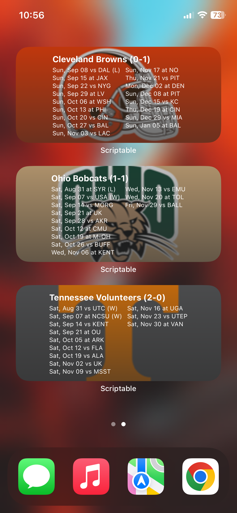
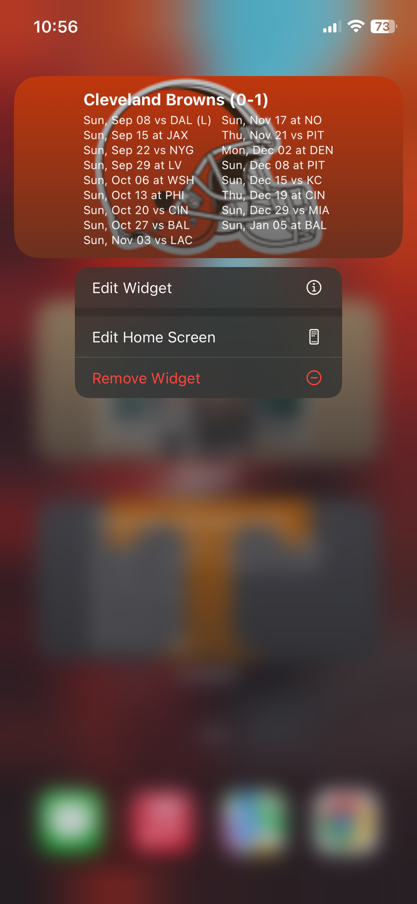
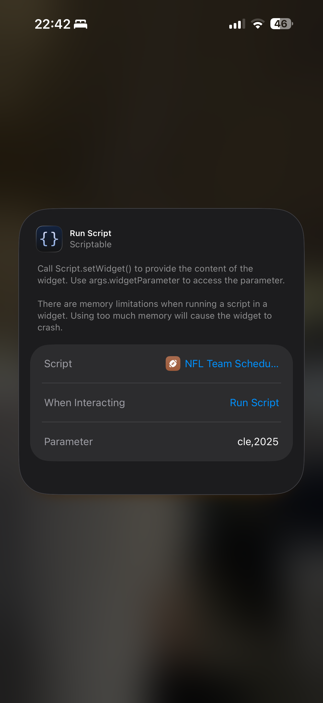

# football-team-schedule-widget
Display any NCAAF/NFL team's schedule on iOS using the [Scriptable](https://scriptable.app/) app.

## Setup
1. Download the [Scriptable](https://scriptable.app/) app from the app store
2. Create a new script in the Scriptable app
3. Copy & paste the code from [ncaaf-script.js](https://raw.githubusercontent.com/brianwalborn/football-team-schedule-widget/main/ncaaf-script.js) or [nfl-script.js](https://raw.githubusercontent.com/brianwalborn/football-team-schedule-widget/main/nfl-script.js) into the newly created script
4. Create a new widget on your homescreen, select the newly created script, and pass in a valid team abbreviation.
  - NCAAF: too many to list, and is much more forgiving than the NFL widget (for example: for Clemson both `clem` and `clemson` can be used, for Kentucky both `uk` and `kentucky` can be used, Ohio State is `ohiost`, Oregon State is `oregonst`, Oklahoma State is `okst`, so on and so forth)
  - NFL: `ARI`, `ATL`, `BAL`, `BUF`, `CAR`, `CHI`, `CIN`, `CLE`, `DAL`, `DEN`, `DET`, `GB`, `HOU`, `IND`, `JAX`, `KC`, `LAR`, `LAC`, `LV`, `MIA`, `MIN`, `NE`, `NO`, `NYJ`, `NYG`, `PHI`, `PIT`, `SEA`, `SF`, `TB`, `TEN`, `WAS`

