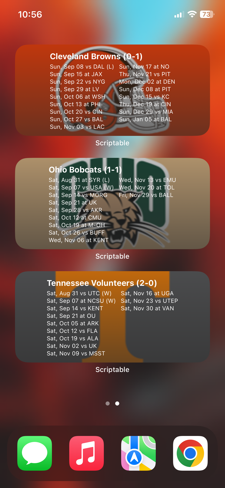
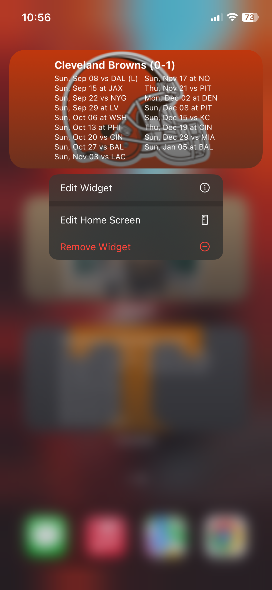
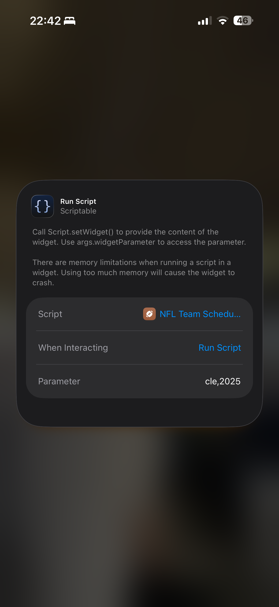

# football-team-schedule-widget

Display any NCAAF/NFL team's schedule on iOS using the [Scriptable](https://scriptable.app/) app.

## Setup

1. Download the [Scriptable](https://scriptable.app/) app from the app store
2. Create a new script in the Scriptable app
3. Copy and paste the code from [ncaaf-script.js](https://raw.githubusercontent.com/brianwalborn/football-team-schedule-widget/main/ncaaf-script.js) or [nfl-script.js](https://raw.githubusercontent.com/brianwalborn/football-team-schedule-widget/main/nfl-script.js) into the newly created script
4. Create a new widget on your homescreen, select the newly created script, and pass a widget parameter in one of these formats:
  - `TEAM_ABBREVIATION`
  - `TEAM_ABBREVIATION,YEAR`

## Parameter examples

- NFL current season: `CLE`
- NFL specific season: `CLE,2024`
- NCAAF current season: `ala`
- NCAAF specific season: `ala,2024`

## Team inputs

- NCAAF: too many to list, and is much more forgiving than the NFL widget (for example: for Clemson both `clem` and `clemson` can be used, for Kentucky both `uk` and `kentucky` can be used, Ohio State is `ohiost`, Oregon State is `oregonst`, Oklahoma State is `okst`, so on and so forth)

- NFL: `ARI`, `ATL`, `BAL`, `BUF`, `CAR`, `CHI`, `CIN`, `CLE`, `DAL`, `DEN`, `DET`, `GB`, `HOU`, `IND`, `JAX`, `KC`, `LAR`, `LAC`, `LV`, `MIA`, `MIN`, `NE`, `NO`, `NYJ`, `NYG`, `PHI`, `PIT`, `SEA`, `SF`, `TB`, `TEN`, `WSH`

## Recent UI behavior

- The season year is now shown at the start of the header separator line (for example: `2026 ────────────`).
- A small extra gap is applied below the separator for readability.

## Background color options

Both scripts now use the `CONFIG` object for style controls.

- NCAAF (`ncaaf-script.js`):
  - `useTeamPrimaryColorBackground: false` (default)
  - Set to `true` to force the team's primary color.

- NFL (`nfl-script.js`):
  - By default, some teams in `teamsPrimaryColor` use primary color, while others use secondary.
  - `useTeamSecondaryColorBackground: false` (default)
  - Set to `true` to force the team's secondary color for all teams.

## Notes

- If a logo fails to display, try toggling the related background color option in the script's `CONFIG` object.
