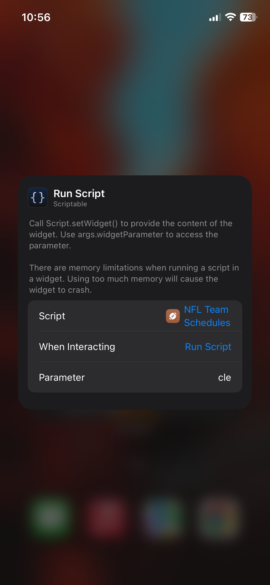

# nfl-team-schedule-widget
Display any NFL team's schedule on iOS using the [Scriptable](https://scriptable.app/) app.

## Setup
1. Download the [Scriptable](https://scriptable.app/) app from the app store
2. Create a new script in the Scriptable app
3. Copy & paste the code from [script.js](https://github.com/brianwalborn/nfl-team-schedule-widget/blob/main/script.js) into the newly created script
4. Create a new widget on your homescreen, select the newly created script, and pass in a team abbreviation (ARI, ATL, BAL, BUF, CAR, CHI, CIN, CLE, DAL, DEN, DET, GB, HOU, IND, JAX, KC, LAR, LAC, LV, MIA, MIN, NE, NO, NYJ, NYG, PHI, PIT, SEA, SF, TB, TEN, WAS)

